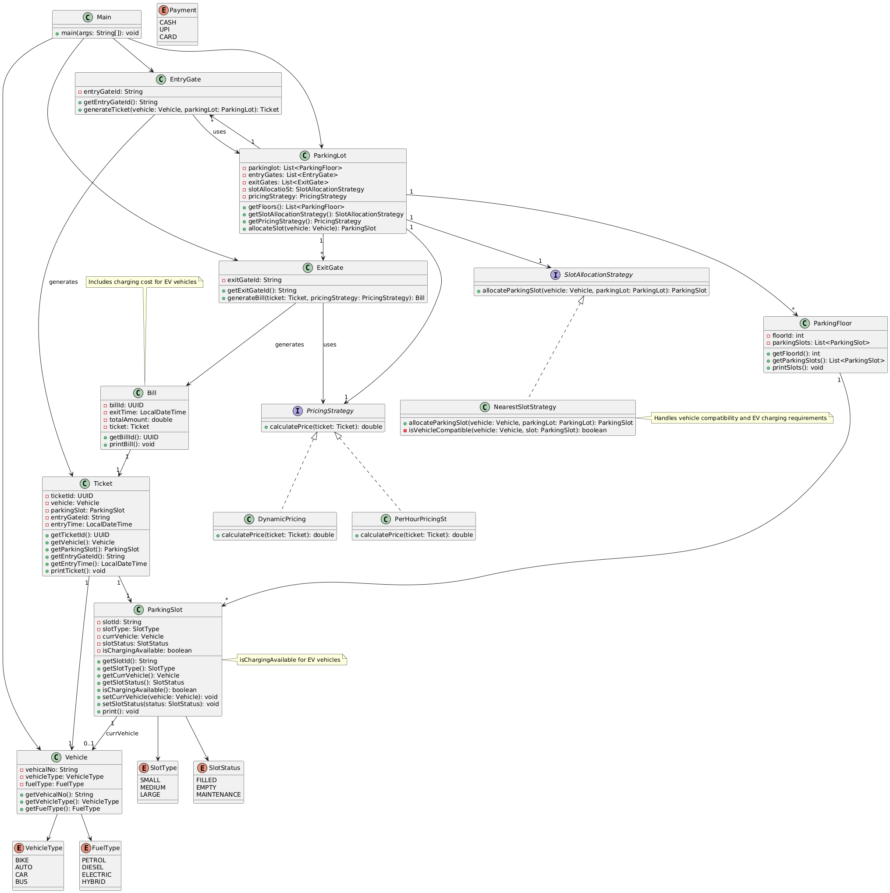

# Parking Lot

## Requirements

### Functional Requirements
 1. **MultiFloor Support**: Parking lot has multiple floors and each floor has parking spots </br>
 2. **Entry/Exit Management**: Multiple entry and exit gates in the ground floor </br>
 3. **Ticket System**: Customer collects ticket at the entry gate, with entry time and slot number </br>
 4. **Payment Processing**: Customers make payment on exit gate </br>
 5. **Capacity Management**: If parking lot is full, no entry allowed </br>
 6. **Vehicle Types**: Support for different vehicle types  auto, bus, bike, EV vehicles </br>
 7. **Special Features**: Some parking spots have power plugs for EV charging </br>
 8. **Flexible Allocation**: Small vehicles can be parked in large vehicle spots </br>
 9. **Smart Allocation**: Allocate nearest available spot </br>
 10. **Scalability**: System can be extended with more floors and slots in future </br>
 11. **Ticket**: Contains Vehicle Number | Entry Gate ID | Entry Time | Slot </br>
 12. **Bill**: Charges according to spot | Extra charges for electricity usage | Time-based pricing </br>

## Class Diagram



## Architecture Overview

The parking lot system follows object-oriented design principles with clear separation of concerns:

### Core Components

- **ParkingLot**: Main orchestrator managing floors, gates, and overall operations
- **ParkingFloor**: Represents individual floors with multiple parking slots
- **ParkingSlot**: Individual parking spaces with type, status, and charging capabilities
- **EntryGate/ExitGate**: Handle vehicle entry/exit and ticket/bill generation
- **Vehicle**: Represents different vehicle types (Car, Bike, Bus, EV)
- **Ticket/Bill**: Transaction records for parking sessions

### Strategy Patterns

- **SlotAllocationStrategy**: Pluggable algorithms for slot assignment (NearestSlotStrategy)
- **PricingStrategy**: Flexible pricing models (DynamicPricing, PerHourPricing)

### Key Design Features

- **Strategy Pattern**: For slot allocation and pricing flexibility
- **Enum-based Type Safety**: Vehicle types, slot types, payment methods
- **Extensible Architecture**: Easy to add new floors, slot types, and strategies
- **EV Support**: Special handling for electric vehicle charging requirements

## Folder Structure

```
cs04_ParkingLot/
├── src/
│   ├── Main.java
│   ├── enums/
│   │   ├── FuelType.java
│   │   ├── Payment.java
│   │   ├── SlotStatus.java
│   │   ├── SlotType.java
│   │   └── VehicleType.java
│   ├── interfaces/
│   │   ├── PricingStrategy.java
│   │   └── SlotAllocationStrategy.java
│   ├── models/
│   │   ├── Bill.java
│   │   ├── EntryGate.java
│   │   ├── ExitGate.java
│   │   ├── ParkingFloor.java
│   │   ├── ParkingLot.java
│   │   ├── ParkingSlot.java
│   │   ├── Ticket.java
│   │   └── Vehicle.java
│   └── strategies/
│       ├── DynamicPricing.java
│       ├── NearestSlotStrategy.java
│       └── PerHourPricingSt.java
├── out/                    # Compiled classes
├── class-diagram.png       # UML class diagram
├── notes.md               # Development notes
├── settings.json          # Project settings
└── README.MD              # This file
```

